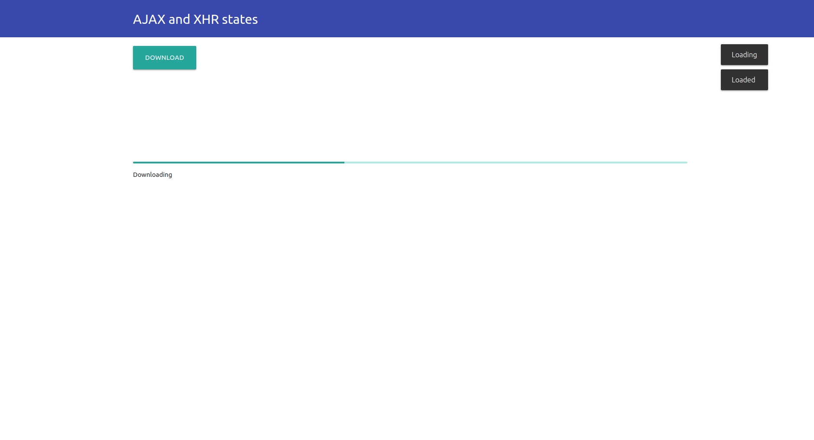
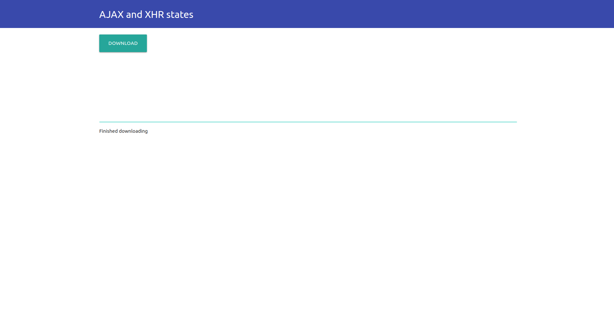

= HW2: AJAX and XHR states

Simple SPA for XHR states demonstration.

== Prerequisites

    node v14.16.0+

== Implementation

=== Server

Server is implemented using NodeJS within the `src/server.js` file. +
It serves as file resource provider.

Implementation is based on asynchronous I/O and uses Promises to avaid manual callback passing, which can lead to callback hell.

Phases of request handling:

1. Parse the requested file path.
2. Check file existence.
3. Read and return file content.
** If there is an error, return 4xx response

=== Client

Client is implemented using vanilla JavaScript and Materialize.

It's composed of download action button, progress bar and status text field. +

When the button is clicked, client sends XHR to the server and fetches the requested file.

== Run the application

Within the `src/` directory, run the following command:

    node server.js

Open `src/index.html` file in web browser (Google Chrome recommended).