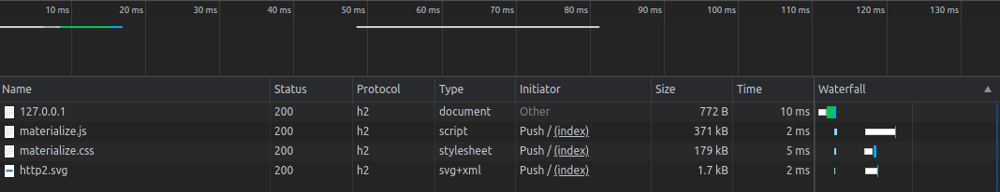

= HW6: HTTP/2 push

Demonstration of simple HTTP/2 push mechanism and it's advantages.

== Prerequisites

    node v14.16.0+

== Implementation

Implementation consists of two simple servers implemented in NodeJS.

1. `src/http2-server.js`: http/2 server implemented using NodejS http2 module
2. `src/http-server.js`: http server implemented using NodeJS http module

Both servers have access to `src/public/` directory where the `index.html` file and required assets are placed.

== HTTP/2 advantages

HTTP/2 has several advantages compared to the HTTP.

Let's name some of HTTP/2 advantages:

* The communication is encrypted using TLS
* Headers compression
* Server Push
** Ability to specify requested resources on initial request (not after parsing the HTML on the client side)

=== HTTP/2 vs HTTP on materialize library

We can see that the browser sent all the requests without waiting for the initial request to finish and the response to be parsed. +
The result is that the resources were loaded faster than by HTTP.

==== HTTP

==== HTTP/2

=== HTTP/2 vs HTTP on materialize library with slower connection

We can see that HTTP/2 performace was worse than HTTP's with slower connection (Fast 3G using Google Chrome DevTools).

==== HTTP

=== HTTP/2

=== HTTP/2 vs HTTP on custom assets

Previously we couldn't see the improvement caused by headers compression due to the size of the assets.
After defining some custom script and stylesheet, we can see the size reduction achieved by HTTP/2.

==== HTTP

==== HTTP/2

